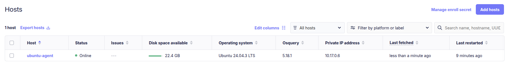
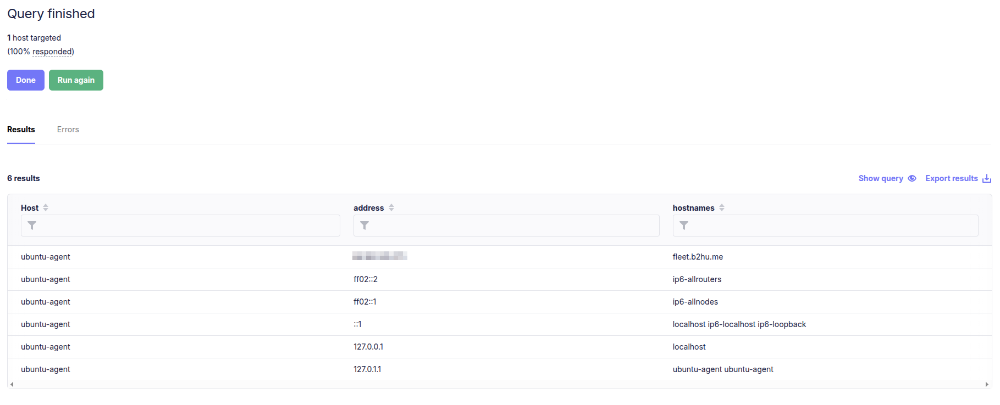

Hi! Today I’ll walk you through deploying and using **FleetDM with osquery** to gain deep visibility into endpoints for monitoring and cybersecurity defense. FleetDM is an open-source platform for managing osquery at scale, allowing you to query, collect, and analyze endpoint data across your infrastructure. Let’s dive in!

> This post focuses on FleetDM deployment and usage. For a deep dive into osquery itself, check out the official osquery documentation [official osquery documentation](https://osquery.readthedocs.io/en/stable/) for background.  
{: .prompt-info }

## What is FleetDM?

**FleetDM** is an open-source osquery management platform that lets security teams deploy osquery agents, collect telemetry, run live queries, and build policies at scale. It acts as a central management server where endpoints securely send query results.  

### Key Features of FleetDM
- **Centralized osquery management**
- **Live query execution** across thousands of endpoints
- **Scheduled queries and policies**
- **Flexible deployment** (Docker, Kubernetes, bare metal)
- **Integrations** with SIEMs, EDRs, and other security tools

---
## Deployment Setup (FleetDM + Docker)

For this demonstration, we’ll deploy FleetDM using **Docker Compose**.

### Prerequisites
- A Linux server (Ubuntu/Debian recommended)
- Docker and Docker Compose installed
- At least 2 GB RAM and 2 CPU cores

### Docker Compose File
Here’s a basic docker-compose.yml with MySQL and Redis (replace environment values as needed):

```yaml
services:
  mysql:
    image: mysql:latest
    volumes:
      - mysql:/var/lib/mysql
    restart: always
    environment:
      - MYSQL_ROOT_PASSWORD=$ROOT_PASSWORD
      - MYSQL_DATABASE=fleet
      - MYSQL_USER=fleet
      - MYSQL_PASSWORD=$USER_PASSWORD
    ports:
      - "3306:3306"
    healthcheck:
      test: ["CMD", "mysqladmin", "ping", "-h", "localhost", "-p$ROOT_PASSWORD"]
      interval: 10s
      timeout: 5s
      retries: 10

  redis:
    image: redis:latest
    volumes:
      - redis:/data
    ports:
      - "6379:6379"
    healthcheck:
      test: ["CMD", "redis-cli", "ping"]
      interval: 10s
      timeout: 5s
      retries: 5
volumes:
  mysql:
  redis:
```
check with ***docker ps***
```shell
root@fleet-server:~/fleet# docker ps
CONTAINER ID   IMAGE          COMMAND                  CREATED          STATUS                    PORTS                                                    NAMES
b37b2fa527b4   mysql:latest   "docker-entrypoint.s…"   15 seconds ago   Up 15 seconds (healthy)   0.0.0.0:3306->3306/tcp, [::]:3306->3306/tcp, 33060/tcp   fleet-mysql-1
2244e5c47ab9   redis:latest   "docker-entrypoint.s…"   15 seconds ago   Up 15 seconds (healthy)   0.0.0.0:6379->6379/tcp, [::]:6379->6379/tcp              fleet-redis-1
``` 
### Fleet installation 
- Generate TLS certificates :

Use self-signed certificates for testing:
```shell
# generate a private key 
openssl ecparam -name prime256v1 -genkey -noout -out fleet.pem

# generate a self signed cert (CN= your sevrer hostname - for me fleet.b2hu.me)
openssl req -new -x509 -key fleet.pem -out fleet.cert -days 365
``` 
- Creating service Accounts :
```shell
sudo groupadd fleet
sudo useradd -Mrg fleet fleet
sudo chown fleet:fleet fleet.cert
sudo chown fleet:fleet fleet.pem
```
- download latest **Fleet** Packages 
```shell
wget https://github.com/fleetdm/fleet/releases/download/fleet-v4.72.1/fleetctl_v4.72.1_linux_amd64.tar.gz
tar xvf fleetctl_v4.72.1_linux_amd64.tar.gz
cp fleetctl_v4.72.1_linux_amd64/fleetctl /usr/bin
# Repeat for fleet binary
```
- Prepare Database
```shell
# this might take a while 
fleet prepare db \
  --mysql_address=127.0.0.1:3306 \
  --mysql_database=fleet \
  --mysql_username=root \
  --mysql_password=$ROOT_PASSWORD
```
- Move Certificates & Configure Systemd
```shell
mv fleet.cert /etc/ssl
mv fleet.pem /etc/ssl
```

***/etc/systemd/system/fleet.service:***

```shell
[Unit]
Description=Fleet
After=network.target

[Service]
User=fleet
Group=fleet
LimitNOFILE=8192
ExecStart=/usr/bin/fleet serve \
  --mysql_address=127.0.0.1:3306 \
  --mysql_database=fleet \
  --mysql_username=root \
  --mysql_password=$ROOT_PASSWORD \
  --redis_address=127.0.0.1:6379 \
  --server_cert=/etc/ssl/fleet.cert \
  --server_key=/etc/ssl/fleet.pem \
  --logging_json

[Install]
WantedBy=multi-user.target
```

start the service :

```shell
systemctl darmon-reload 
systemctl enable --now feet.service
```
you can check if the service is running using :

```shell
netstat -nltp | grep 8080
```
## Adding Hosts : 
Install Fleet agents on hosts and enroll them. For self-signed certs. (NB: for production use  an automated configuration management tool ex. **Ansible**) ensure the .cert file is present on the agent. Example:
```shell
# Add fleet server IP to hosts file
echo "$IP_FLEET fleet.example.com" | sudo tee -a /etc/hosts

# Enroll agent (get enroll secret for the GUI-> add host)
fleetctl package --type=deb --enable-scripts --fleet-desktop \
  --fleet-url=https://fleet.b2hu.me:8080 \
  --enroll-secret=$ENROLL_SECRET \
  --fleet-certificate=fleet.cert
```
Install the package on the agent, and you’re ready!



## Query test

One of the simplest but most effective tricks attackers use is modifying the hosts file to override DNS resolution. For example, they might redirect traffic meant for security.example.com to a malicious IP under their control. This kind of change can silently disable security tools or reroute user traffic.

We can check the contents of ***/etc/hosts*** (Linux/macOS) or ***C:\Windows\System32\drivers\etc\hosts*** (Windows) across all enrolled endpoints with a simple osquery:

```sql
SELECT * FROM etc_hosts;
```
Running this as a live query in FleetDM will return all host file entries from your endpoints.



---

Thank you for Reading! feel free to contact me if you have a question.
